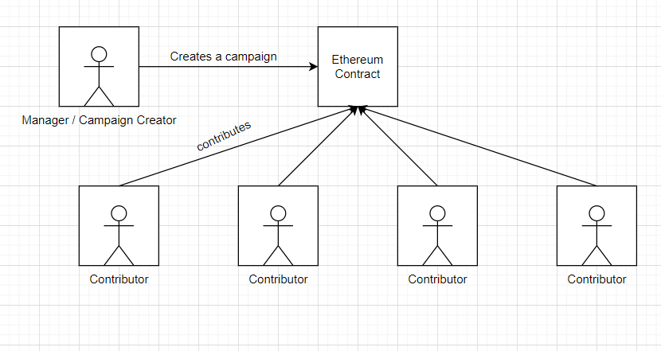
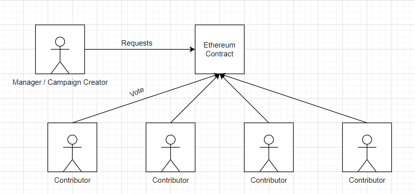
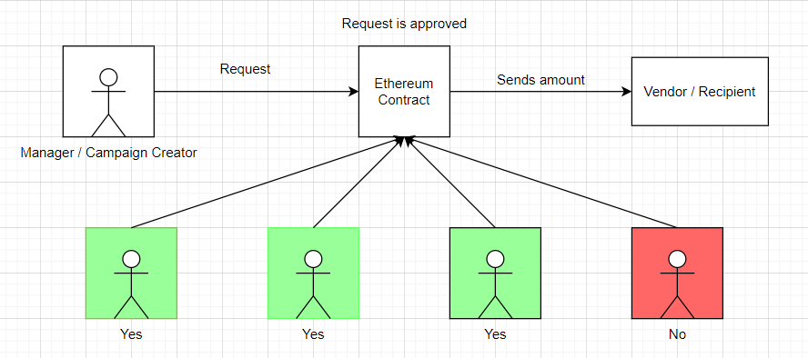

# Kickstarter Voting App  
## Problem Definition  
### Introduction to Kickstarter    
[Kickstarter](https://www.kickstarter.com/) is an application, where developers showcase their product idea in order to get some funding. After the product is ready, the contributors get rewarded in return.  

### Problem Definition  
Certain individuals indulge in fraudulent practices, and instead of using the donated amount for their project, they use it for personal expenses. The contributors then have no way to get their money back.  

### Solution
Instead of sending the money to the developer, the contributors can send the money to an ethereum contract. Whenever the developer wants to withdraw some amount, they will have to create a `spending request` which the contributors will then `vote` on. In case the request is approved, the developer will then be able to withdraw the amount / send the amount to the vendor  

## Run the Application  
1. Clone the repository: `git clone git@github.com:riyasavant/kickstarter-voting.git`
2. `cd kickstart-voting`
3. Install the dependecies: `npm i`
4. Follow the `metamask` setup steps given below
5. Run the project: `npm run dev`
6. Open the application: `localhost:3000`  

## Application Design  
#### 1. Individual creates a campaign (asking for funding), other individuals can contribute to this. The amount being contributed is stored in the Ethereum account   
  
#### 2. When the manager (individual who created the campaign) wants to withdraw an amount, they create a request. Contributors of the project will then vote on the request  
  
#### 3. If the number of `yes` votes are more than the number of `no` votes, the manager can withdraw the requested amount    
  

## Contract Design  
#### Request Struct  
| Name          	| Description                                                                    	| Type                     	|
|---------------	|--------------------------------------------------------------------------------	|--------------------------	|
| description   	| States why the amount is being withdrawn                                       	| string                   	|
| value         	| The amount to be withdrawn                                                     	| uint256                  	|
| recipient     	| The money will be transferred to this address incase the request is successful 	| address                  	|
| complete      	| States whether the request is completed or pending                             	| bool                     	|
| approvalCount 	| Number of positive votes received                                              	| uint256                  	|
| approvals     	| Stores the list of approvers who have voted                                    	| mapping(address => bool) 	|  

#### Storage Variables
| Name                	| Description                                                             	| Type                     	|
|---------------------	|-------------------------------------------------------------------------	|--------------------------	|
| manager             	| Stores the address of manager / individual who creates the campaign     	| address                  	|
| minimumContribution 	| Sets the minimum amount that the contributor can contribute             	| uint                     	|
| approvers           	| Stores the list of approvers / contributors who have contributed        	| mapping(address => bool) 	|
| requests            	| Stores the requests that the manager creates to withdraw certain amount 	| Request[]                	|  

#### Functions  
| Name             	| Description                                                                                	| Who can access 	|
|------------------	|--------------------------------------------------------------------------------------------	|----------------	|
| contribute       	| Adds an individual to the approvers mapping, and stored the amount sent                    	| any individual 	|
| createRequest    	| The manager creates a request to withdraw money, stored in requests array                  	| manager        	|
| approverRequest  	| Takes in account the votes by approvers, and stores the approver and approvalCount         	| approvers      	|
| finalizeRequest  	| The method called by the manager in order to withdraw money incase any request is approved 	| manager        	|
| getSummary       	| Return minimumContribution, approversCount, requests.length, manager and balance           	| any individual 	|
| getRequestsCount 	| Returns the number of requests created by the manager                                      	| any individual 	|   

## Project Setup  
### Metamask  
1. Install the `metamask` extension on chrome
2. Create an account, and store the recovery phrase
3. Set the network to `Rinkeby Test Network`
4. Get some free faucets by visiting [https://faucets.chain.link/rinkeby](https://faucets.chain.link/rinkeby) and [https://rinkeby-faucet.com/](https://rinkeby-faucet.com/)  

### Infura API  
Acts as the medium between web3 and Test network  
1. Visit the site [https://infura.io/](https://infura.io/)
2. Create an account and Verify
3. Create a project under Ethereum section
4. Get the API endpoint  

### Setup the repo  
1. Clone the repository: `git clone git@github.com:riyasavant/kickstarter-voting.git`
2. `cd kickstart-voting`
3. Install the dependecies: `npm i`
4. `cd ethereum`
5. Compile the contract: `node compile.js`
6. Replace your recovery phrase and Infura endpoint in `ethereum/deploy.js` file
7. Deploy the contract: `node deploy.js` and store the deployed contract address in `ethereum/factory.js`
8. Run the project using `npm run dev`  

### Testing  
To test the application using various accounts  
1. Create different accounts on Rinkeby Test Network under the same recovery phrase
2. Follow the same links in order to get faucets
3. Switch to different accounts in order to replicate different users  

## Local testing using Mocha  
Run `npm run test` to test the contract using Mocha
